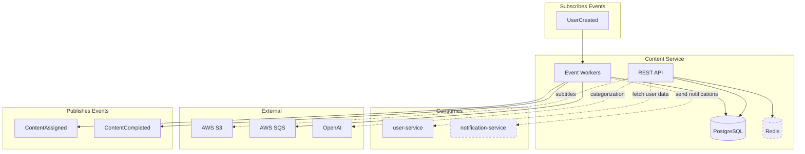
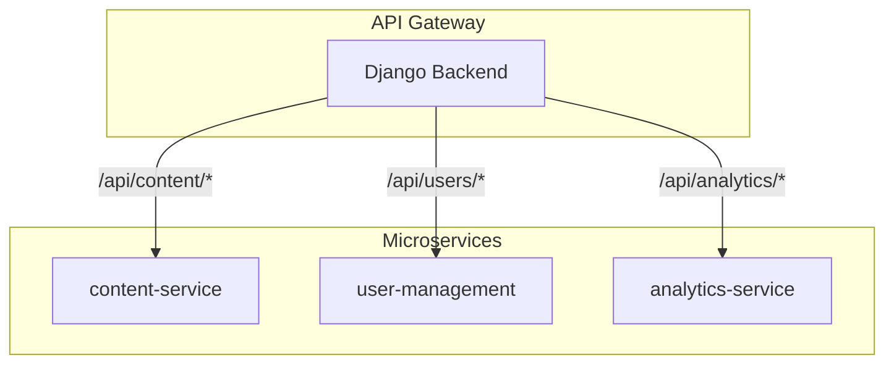
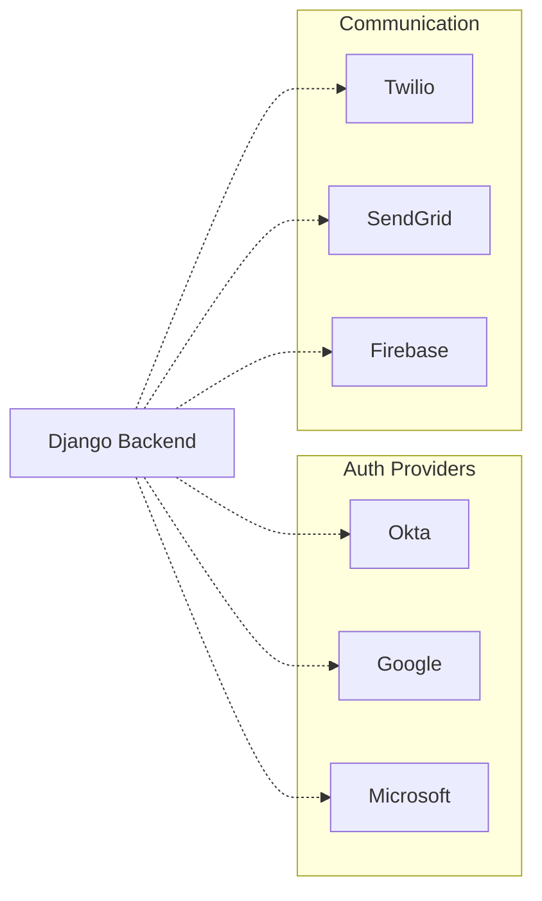

# Developer Overview Generator

Generate high-level developer documentation optimized for understanding service responsibilities and cross-repository integrations. Designed for Claude and developers to quickly grasp what a repo does and how it connects to other services.

## Goal

Produce two files:
1. **DEV_OVERVIEW.md** - Concise service summary with integration points
2. **DEV_OVERVIEW_DIAGRAM.mermaid** - Visual representation of service relationships

## Output Philosophy

- **Integration-first**: Focus on boundaries, not internals
- **Cross-repo context**: What does this service need? What does it provide?
- **Minimal noise**: No file structures, no code patterns, no setup instructions
- **Uncertainty marking**: Use `[INFERRED]` for conclusions drawn from code patterns rather than explicit documentation
- **Adaptive depth**: Gateway/hub services get extended sections; single-purpose services stay minimal

---

## Phase 1: Discovery (2-5 min)

### 1.1 Sync to Latest Code
```bash
# Ensure we're on main/master with latest changes
git checkout main 2>/dev/null || git checkout master
git pull origin HEAD
```

### 1.2 Identify Project Type
```bash
# Check for project markers
ls -la package.json pyproject.toml Cargo.toml go.mod pom.xml build.gradle
```

### 1.3 Extract Service Identity
```bash
# Get service name from configs
grep -r "name" package.json pyproject.toml --include="*.json" --include="*.toml" | head -5
```

### 1.4 Find Entry Points
```bash
# Common entry patterns
find . -name "main.*" -o -name "app.*" -o -name "index.*" -o -name "server.*" | grep -v node_modules | grep -v __pycache__
```

---

## Phase 2: Integration Detection (5-10 min)

### 2.1 APIs Exposed (What This Service Provides)

**REST/HTTP endpoints:**
```bash
# Express/Fastify/Koa
grep -rn "app\.\(get\|post\|put\|delete\|patch\)" --include="*.ts" --include="*.js" | head -20

# NestJS/decorators
grep -rn "@\(Get\|Post\|Put\|Delete\|Patch\|Controller\)" --include="*.ts" | head -20

# FastAPI/Flask/Django
grep -rn "@app\.\(get\|post\|put\|delete\|route\)" --include="*.py" | head -20
grep -rn "path\|re_path\|url" --include="urls.py" | head -20
```

**GraphQL:**
```bash
grep -rn "type Query\|type Mutation\|@Query\|@Mutation" --include="*.ts" --include="*.graphql" | head -10
```

**gRPC:**
```bash
find . -name "*.proto" | head -5
grep -rn "service\s\+\w\+" --include="*.proto" | head -10
```

### 2.2 APIs Consumed (What This Service Needs)

**HTTP clients:**
```bash
# Axios/fetch/http calls
grep -rn "axios\|fetch\|httpClient\|requests\.\(get\|post\)\|aiohttp" --include="*.ts" --include="*.js" --include="*.py" | grep -v test | head -20

# Service URLs/base URLs
grep -rn "baseURL\|BASE_URL\|API_URL\|SERVICE_URL" --include="*.ts" --include="*.js" --include="*.py" --include="*.env*" | head -10
```

**SDK/Client imports:**
```bash
grep -rn "import.*Client\|from.*client\|require.*client" --include="*.ts" --include="*.js" --include="*.py" | grep -v test | head -10
```

### 2.3 Message Queues & Events

**Publishers:**
```bash
# Kafka/RabbitMQ/SQS/Redis pub
grep -rn "publish\|produce\|send_message\|emit\|dispatch" --include="*.ts" --include="*.js" --include="*.py" | grep -v test | head -15

# Event/message names
grep -rn "topic\|queue\|channel\|event.*=\|EVENT_" --include="*.ts" --include="*.js" --include="*.py" | head -15
```

**Subscribers:**
```bash
grep -rn "subscribe\|consume\|on_message\|@EventPattern\|@MessagePattern" --include="*.ts" --include="*.js" --include="*.py" | grep -v test | head -15
```

### 2.4 Data Storage

**Databases:**
```bash
# Connection strings / ORM models
grep -rn "DATABASE_URL\|MONGO_URI\|REDIS_URL\|postgres\|mysql\|mongodb" --include="*.env*" --include="*.ts" --include="*.py" | head -10

# Table/Collection definitions
grep -rn "CREATE TABLE\|@Entity\|@Table\|class.*Model\|Schema\(" --include="*.ts" --include="*.js" --include="*.py" --include="*.sql" | head -20
```

**Cache:**
```bash
grep -rn "redis\|memcached\|cache" --include="*.ts" --include="*.js" --include="*.py" | grep -v test | head -10
```

### 2.5 External Services

```bash
# Third-party integrations
grep -rn "aws\|gcp\|azure\|stripe\|twilio\|sendgrid\|openai\|slack\|s3\|sqs\|sns" --include="*.ts" --include="*.js" --include="*.py" --include="*.env*" -i | head -15
```

### 2.6 Gateway/Hub Detection

> If multiple patterns match, treat as gateway and include Extended Sections.

```bash
# Proxy/routing patterns
grep -rn "proxy\|forward\|route.*service\|createProxyMiddleware" --include="*.ts" --include="*.js" --include="*.py" | head -10

# Multiple service URLs in config
grep -rn "SERVICE_URL\|_SERVICE_\|_API_URL" --include="*.env*" --include="*.ts" --include="*.py" | wc -l
# If count > 3, likely a gateway

# Auth middleware/backends
grep -rn "authenticate\|OAuth\|OIDC\|SAML\|JWT\|passport" --include="*.ts" --include="*.js" --include="*.py" | head -10

# Middleware chains
grep -rn "middleware\|use\(.*\)\|MIDDLEWARE" --include="*.ts" --include="*.js" --include="settings*.py" | head -15
```

**Gateway indicators:**
- Proxies requests to 3+ other services
- Owns authentication/authorization logic
- Has middleware pipeline configuration
- Contains environment URLs for multiple services

---

## Phase 3: Domain Extraction (3-5 min)

### 3.1 Core Domain Concepts
```bash
# Find model/entity definitions
find . -path "*/models/*" -o -path "*/entities/*" -o -path "*/domain/*" | grep -v node_modules | head -20

# Extract class/type names
grep -rn "^class\|^interface\|^type\|^export class" --include="*.ts" --include="*.py" | grep -v test | head -30
```

### 3.2 Business Operations
```bash
# Service/use-case methods
grep -rn "async\s\+\w\+\|def\s\+\w\+\|function\s\+\w\+" --include="*service*.ts" --include="*service*.py" --include="*usecase*.ts" | head -20
```

---

## Phase 4: Documentation Generation

### Output File 1: DEV_OVERVIEW.md

```markdown
# [Service Name] - Developer Overview

> Auto-generated: [Date]
> Source: [Repo URL]

## Responsibility

[1-2 sentence description of what this service owns]

## Tech Stack

- **Language:** [e.g., TypeScript, Python]
- **Framework:** [e.g., NestJS, FastAPI]
- **Database:** [e.g., PostgreSQL, MongoDB]

## Exposes

### APIs
| Endpoint/Method | Purpose |
|-----------------|---------|
| `POST /assignments` | Create content assignment |
| `GET /feed` | Retrieve user content feed |

### Events Published
| Event | Trigger |
|-------|---------|
| `ContentAssigned` | When content is assigned to users |
| `ContentCompleted` | When user finishes content |

## Consumes

### Services
| Service | Purpose |
|---------|---------|
| `user-service` | User attributes, org membership |
| `notification-service` | Push notifications [INFERRED] |

### Events Subscribed
| Event | Source | Purpose |
|-------|--------|---------|
| `UserCreated` | user-service | Trigger onboarding sequence |

## Data Ownership

### Primary Storage
| Table/Collection | Purpose |
|------------------|---------|
| `bites_feed` | User content feed items |
| `bites_content_assignment` | Assignment records |

### Caches
- Redis: Feed query cache [INFERRED]

## External Dependencies

| Service | Purpose |
|---------|---------|
| AWS S3 | Subtitle file storage |
| AWS SQS | Async event processing |
| OpenAI | Content categorization |

## Key Domain Concepts

- **Bite**: Short-form educational video
- **Assignment**: Content → User mapping with tracking
- **Feed**: Personalized content stream per user

---

## Extended Sections (Gateway/Hub Services Only)

> Include these sections only if the service acts as an API gateway, auth provider, or orchestrator.
> Skip for single-purpose microservices.

### Proxied Routes (if API Gateway)

| Route Pattern | Target Service | Purpose |
|---------------|----------------|---------|
| `/api/content/*` | content-service | Content processing |
| `/api/users/*` | user-management-service | User operations |

### Authentication Architecture (if Auth Provider)

**Supported Methods:**
| Method | Implementation |
|--------|----------------|
| JWT | `library-name` |
| OAuth2 | `library-name` |
| SSO/OIDC | Provider names |

**Auth Flow Priority:** [List backends in order]

### Middleware Pipeline (if relevant)

| Order | Middleware | Purpose |
|-------|------------|---------|
| 1 | `AuthMiddleware` | Token validation |
| 2 | `RateLimitMiddleware` | Request throttling |

### Task Queue (if async processing)

- **Broker:** [e.g., Redis, RabbitMQ]
- **Framework:** [e.g., Celery, Bull]
- **Key Tasks:** [List major background jobs]

### Environment Configuration (if orchestrator)

| Variable | Purpose |
|----------|---------|
| `SERVICE_A_URL` | Service A endpoint |
| `SERVICE_B_URL` | Service B endpoint |

---

## Notes

- Items marked `[INFERRED]` were deduced from code patterns and may need verification
- Generated by dev-overview-generator skill
```

### Output File 2: DEV_OVERVIEW_DIAGRAM.mermaid



### Gateway Services: Split Diagrams

For complex gateway/hub services, create two diagrams:

**DEV_OVERVIEW_DIAGRAM_TOPOLOGY.mermaid** - Service relationships:


**DEV_OVERVIEW_DIAGRAM_INTEGRATIONS.mermaid** - External systems:


---

## Quality Checklist

Before finalizing, verify:
- [ ] Service responsibility is clear in 1-2 sentences
- [ ] All external API calls identified
- [ ] All event publishers/subscribers found
- [ ] Database tables/collections listed
- [ ] External services (AWS, third-party) documented
- [ ] `[INFERRED]` markers on uncertain items
- [ ] Mermaid diagram reflects all integrations
- [ ] No internal implementation details leaked

**For Gateway/Hub Services only:**
- [ ] Proxied routes documented with target services
- [ ] Auth methods and flow priority listed
- [ ] Middleware pipeline order documented
- [ ] Service URL environment variables listed
- [ ] Consider splitting Mermaid into topology + integrations diagrams

## INFERRED Marker Guidelines

Use `[INFERRED]` when:
- Service name deduced from URL patterns, not explicit config
- Event purpose guessed from handler code
- External service detected from SDK import, not documented usage
- Cache/queue usage assumed from library presence

Do NOT infer:
- Database tables (these are explicit in migrations/models)
- API endpoints (these are explicit in route definitions)
- Event names (these are explicit in publish/subscribe calls)

---

## Configuration (Optional)

If repo contains `.dev-overview-config.json`:

```json
{
  "service_name": "content-service",
  "output_dir": "docs/",
  "exclude_paths": ["tests/", "scripts/"],
  "known_services": {
    "user-service": "User management and authentication",
    "notification-service": "Push and email notifications"
  },
  "diagram_style": "flowchart TB"
}
```