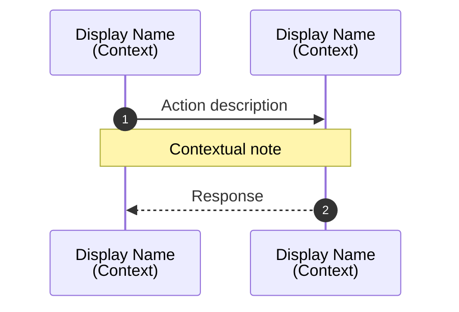
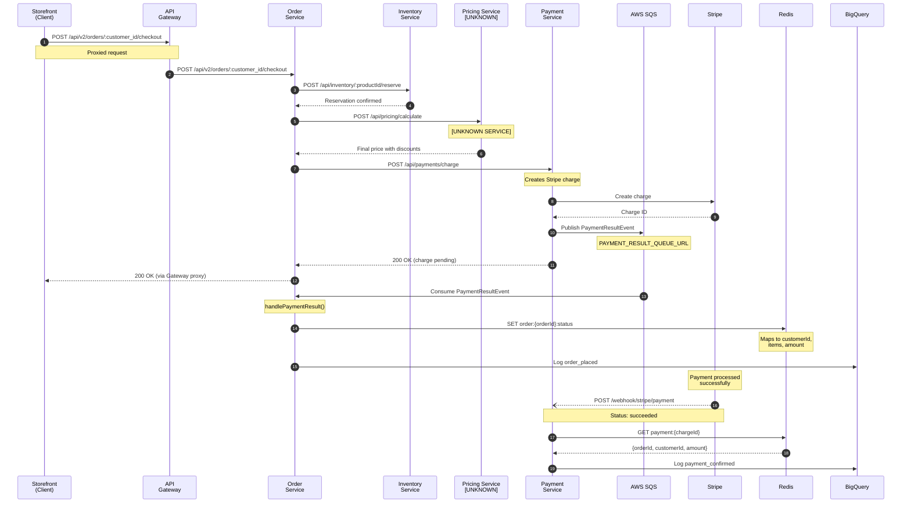

# Flow Diagram Generator

Generate Mermaid sequence diagrams from end-to-end flows defined in `_connections.yaml`.

## Goal

Produce visual sequence diagrams:
- **`diagrams/{flow-name}.mermaid`** - One diagram per e2e flow

## Input

- `docs/tech/flows/technical/_connections.yaml` - Generated by connections-builder skill
- Specifically the `e2e_flows` section

## Output Location

```
docs/tech/flows/technical/diagrams/{flow-name}.mermaid
```

---

## Output Format

Mermaid sequence diagram syntax:



---

## Participant Naming

### Services
```yaml
participant Gateway as API Gateway<br/>Backend
participant Orders as Order<br/>Service
participant Inventory as Inventory<br/>Service
participant Payments as Payment<br/>Service
```

### External Services
```yaml
participant Stripe as Stripe
participant SQS as AWS SQS
participant Redis as Redis
participant BQ as BigQuery
participant PG as PostgreSQL
```

### Clients
```yaml
participant Client as Client<br/>(Web/Mobile)
participant Admin as Admin<br/>Dashboard
```

### Unknown Services
Always mark with `[UNKNOWN]`:
```yaml
participant Recommend as Recommendation<br/>Service<br/>[UNKNOWN]
```

---

## Arrow Types

| Arrow | Meaning | Usage |
|-------|---------|-------|
| `->>` | Sync request | HTTP calls, queue publish |
| `-->>` | Sync response | HTTP response |
| `--)` | Async message | Fire-and-forget, webhook |
| `--x` | Failed/error | Error responses |

---

## Step Type Mapping

Map `_connections.yaml` step types to Mermaid:

| Step Type | Mermaid Pattern |
|-----------|-----------------|
| `http` | `Source->>Target: VERB /path` |
| `http_proxy` | `Source->>Gateway: VERB /path` + `Note` + `Gateway->>Target: proxied` |
| `queue` | `Publisher->>SQS: Publish {MessageType}` + `SQS->>Consumer: Consume` |
| `webhook` | `External--)Service: POST /webhook/path` |
| `external` | `Service->>External: Action` |
| `database` | `Service->>DB: Operation` |
| `cache` | `Service->>Redis: GET/SET pattern` |
| `analytics` | `Service->>Analytics: Log event_type` |

---

## Diagram Structure

### Header
```mermaid
%% End-to-End Flow: {Flow Name}
%% Auto-generated from _connections.yaml
%% Source: {source file path}

sequenceDiagram
    autonumber
```

### Participants
Order participants left-to-right by flow:
1. Client/trigger source
2. Gateway (if applicable)
3. Services (in order of involvement)
4. External services
5. Data stores (DB, Cache, Analytics)

### Steps
Convert each step to Mermaid syntax with:
- Action on arrow label
- Notes for context
- Boxes for parallel or optional flows

### Parallel Flows
Use `par` block:
```mermaid
par Consumer A
    SQS->>ServiceA: Consume
    ServiceA->>External: Action
and Consumer B
    SQS->>ServiceB: Consume
    ServiceB->>DB: Write
end
```

### Optional Flows
Use `alt` block:
```mermaid
alt Condition is true
    Service->>External: Do something
else Condition is false
    Service->>Other: Do other thing
end
```

### Async Callbacks
Show time passing:
```mermaid
Note over External: Processing...<br/>Payment confirmed

External--)Service: POST /webhook/status
```

---

## Execution Instructions

### Step 1: Read _connections.yaml

Load the file and extract `e2e_flows` section.

### Step 2: For Each Flow

Process one flow at a time:

1. **Extract metadata**
   - `name` → file name (kebab-case)
   - `description` → header comment

2. **Identify participants**
   - Scan all steps for unique `source` and `target` values
   - Include external services, queues, databases
   - Order by first appearance

3. **Generate participant declarations**
   - Create short alias (Gateway, Orders, Inventory)
   - Add display name with line break
   - Mark `[UNKNOWN]` services

4. **Convert each step**
   - Map step type to arrow pattern
   - Include verb + path for HTTP
   - Include message type for queues
   - Add notes for context

5. **Add response arrows**
   - After sync calls, add `-->>` response
   - After webhooks, no response (async)

6. **Write file**
   - Save to `diagrams/{flow-name}.mermaid`

### Step 3: Create Index

Optionally create `diagrams/_index.md` listing all diagrams:

```markdown
# Flow Diagrams

| Flow | Description | Diagram |
|------|-------------|---------|
| Order Checkout | Customer places order... | [View](order-checkout.mermaid) |
```

---

## Example Transformation

**Input (_connections.yaml excerpt):**
```yaml
e2e_flows:
  - name: Order Checkout with Payment
    description: Customer checks out cart, payment is processed, order is fulfilled
    steps:
      - seq: 1
        type: http
        source: storefront (client)
        target: api-gateway
        path: POST /api/v2/orders/:customer_id/checkout
        note: Proxied to order-service

      - seq: 2
        type: http
        source: order-service
        target: inventory-service
        path: POST /api/inventory/:productId/reserve
        note: Reserve stock

      - seq: 3
        type: http
        source: order-service
        target: "[UNKNOWN] pricing-service"
        path: POST /api/pricing/calculate
        note: Calculate final price with discounts (optional)

      - seq: 4
        type: http
        source: order-service
        target: payment-service
        path: POST /api/payments/charge
        note: Initiate payment

      - seq: 5
        type: external
        source: payment-service
        target: Stripe
        action: Create charge

      - seq: 6
        type: queue
        publisher: payment-service
        queue: PAYMENT_RESULT_QUEUE_URL
        consumer: order-service

      - seq: 7
        type: cache
        source: order-service
        target: Redis
        action: Store order status context

      - seq: 8
        type: analytics
        source: order-service
        target: BigQuery
        event: order_placed

      - seq: 9
        type: webhook
        source: Stripe
        target: payment-service
        path: POST /webhook/stripe/payment
        note: Payment confirmation

      - seq: 10
        type: analytics
        source: payment-service
        target: BigQuery
        event: payment_confirmed
```

**Output (order-checkout.mermaid):**


---

## Diagram Enhancements

### Add Visual Grouping

For complex diagrams, use boxes:
```mermaid
box Backend Services
    participant Gateway
    participant Orders
    participant Inventory
end

box External
    participant Stripe
    participant ShipStation
end
```

### Add Activation Bars

Show when a service is actively processing:
```mermaid
activate Orders
Orders->>Inventory: Request
Inventory-->>Orders: Response
Orders->>Payments: Charge
deactivate Orders
```

### Add Loop/Repeat

For batch operations:
```mermaid
loop For each item in cart
    Orders->>Inventory: Reserve stock
end
```

---

## Quality Checklist

Before finalizing, verify:

- [ ] All participants declared before first use
- [ ] `[UNKNOWN]` services clearly marked
- [ ] Arrows match sync/async nature
- [ ] Notes provide useful context (not redundant)
- [ ] Autonumber enabled for traceability
- [ ] File name matches flow name (kebab-case)
- [ ] Header comment identifies source
- [ ] Responses shown for sync calls
- [ ] Time gaps shown for async callbacks

---

## Notes

- Run this skill after connections-builder
- Generate diagrams for key business flows (not every tiny flow)
- Diagrams should fit on one screen when possible (max ~20 steps)
- For very long flows, consider splitting into sub-flows
- Use consistent participant aliases across all diagrams
- Diagrams are for humans - prioritize clarity over completeness
