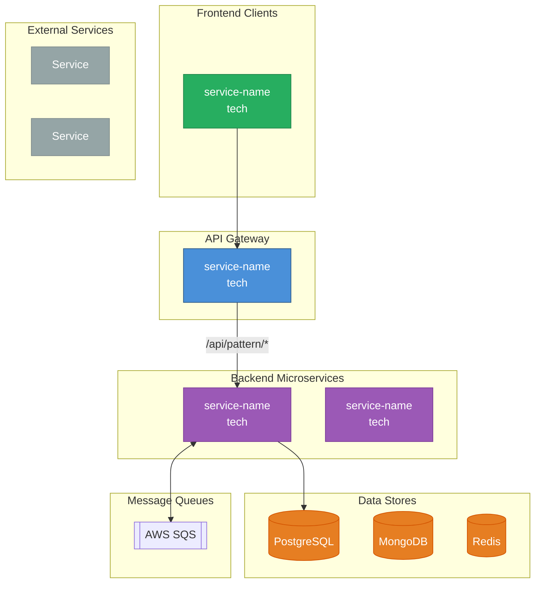

# Topology Generator

Generate a high-level architecture topology from all `DEV_OVERVIEW.md` files, producing both a YAML data file and a visual Mermaid diagram.

## Goal

Produce two files:
- **`topology.yaml`** - Structured service definitions and relationships
- **`topology.mermaid`** - Visual overview diagram

## Input

All files matching: `docs/tech/*_DEV_OVERVIEW.md` or `**/DEV_OVERVIEW.md`

## Output Location

```
docs/tech/topology.yaml
docs/tech/topology.mermaid
```

---

## topology.yaml Schema

```yaml
# Platform Service Topology
# Auto-generated: {date}

hub:
  name: {gateway-service-name}
  role: {description}
  tech: {language/framework}
  database: {primary database}
  proxy_routes:
    {target-service}:
      - /api/pattern/*

services:
  - name: {service-name}
    tech: {language/framework}
    role: {1-line description}
    type: backend | frontend | client
    databases:
      - {database type}
    queues:
      publishes:
        - {queue name}
      consumes:
        - {queue name}
    calls:
      - {service-name}
    external_integrations:
      - {external service}

direct_connections:
  - from: {service-a}
    to: {service-b}
    purpose: {why}

shared_databases:
  postgresql:
    owner: {service-name}
    readers:
      - {service-name}
    writers:
      - {service-name}
    key_tables:
      {domain}:
        - {table_name}

  mongodb:
    collections:
      - {collection} ({owning-service})

external_services:
  {category}:
    - {service name} ({purpose})

notes:
  - {important note}
```

---

## Extraction Rules

### Identify Hub/Gateway

Look for service with:
- "gateway" or "proxy" in description
- `Proxied Routes` section in DEV_OVERVIEW
- Multiple services listed in "Consumes > Services"

### Extract Service Info

From each DEV_OVERVIEW:

| Section | Maps To |
|---------|---------|
| Title | `services[].name` |
| Tech Stack | `services[].tech` |
| Responsibility | `services[].role` |
| Exposes > Events Published | `services[].queues.publishes` |
| Consumes > Events Subscribed | `services[].queues.consumes` |
| Consumes > Services | `services[].calls` |
| External Dependencies | `services[].external_integrations` |
| Data Ownership | `shared_databases` |

### Identify Direct Connections

Services that call each other bypassing the hub:
- Look at `Consumes > Services` for non-gateway calls
- Cross-reference with other services' "Exposes > APIs"

### Categorize External Services

Group into categories:
- `auth_providers`: Okta, Azure AD, Google OAuth, etc.
- `communication`: Twilio, SendGrid, FCM, Slack, etc.
- `cloud`: AWS S3, SQS, SNS, etc.
- `ai`: OpenAI, AWS Rekognition, etc.
- `monitoring`: Datadog, Sentry, etc.

---

## topology.mermaid Format



---

## Execution Instructions

### Step 1: Find All DEV_OVERVIEW Files

```bash
find docs/tech -name "*DEV_OVERVIEW.md" -o -name "*_DEV_OVERVIEW.md"
```

### Step 2: Identify the Hub

Scan for gateway characteristics:
- Has `Proxied Routes` section
- Calls multiple other services
- Usually Django, Express, or similar framework

### Step 3: Extract Each Service

For each DEV_OVERVIEW:
1. Parse header for name and tech
2. Extract role from Responsibility
3. List databases from Data Ownership
4. List queues from Events Published/Subscribed
5. List calls from Consumes > Services
6. List externals from External Dependencies

### Step 4: Build Shared Database Map

Aggregate all Data Ownership sections:
1. Identify who owns each table
2. Identify who reads (read-only access)
3. Identify shared tables (multiple writers)

### Step 5: Identify Direct Connections

For each service's `Consumes > Services`:
- If target is NOT the hub → direct connection
- Add to `direct_connections` with purpose

### Step 6: Generate topology.yaml

Assemble all extracted data into YAML structure.

### Step 7: Generate topology.mermaid

1. Create subgraphs for: Clients, Hub, Microservices, Data, Queues, External
2. Add nodes for each service
3. Draw connections based on:
   - Proxy routes (Hub → Service)
   - Direct connections (Service → Service, dashed)
   - Data access (Service → Database)
   - Queue usage (Service ↔ SQS)
4. Apply styling classes

### Step 8: Write Files

Save both files to `docs/tech/`.

---

## Quality Checklist

- [ ] All services from DEV_OVERVIEWs included
- [ ] Hub correctly identified
- [ ] Proxy routes complete
- [ ] Direct connections captured
- [ ] Database ownership clear
- [ ] External services categorized
- [ ] Mermaid diagram renders correctly
- [ ] No orphan services (disconnected nodes)
- [ ] Frontend clients included if documented

---

## Notes

- Run this skill when adding new services or updating architecture
- Topology is high-level - details are in individual service files
- Mermaid diagram should fit on one screen
- For very large systems, consider grouping services by domain
- Update when services are added, removed, or change relationships
